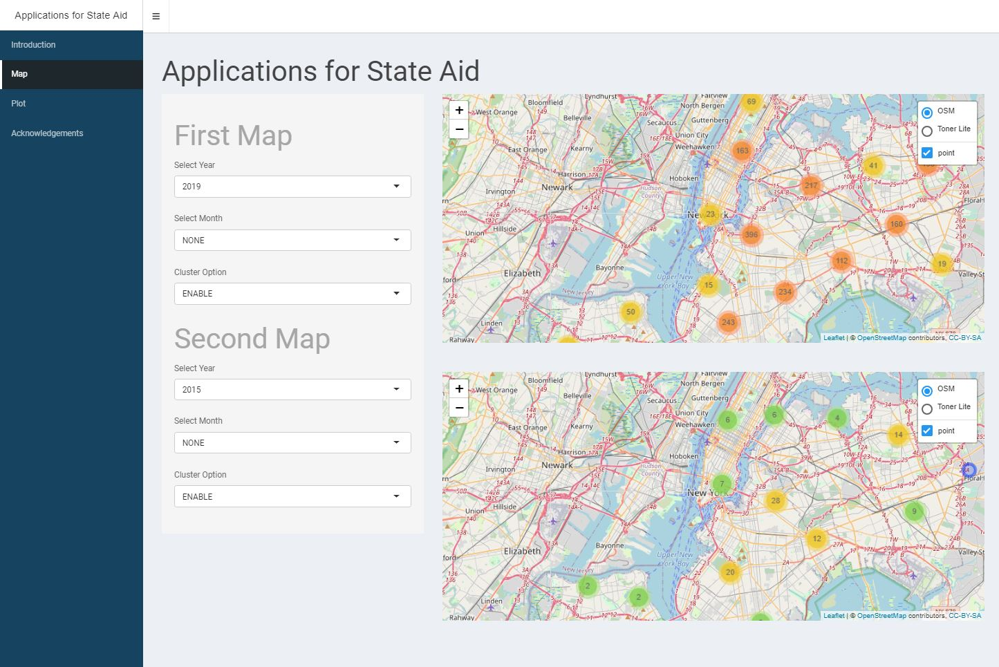

# Project 2: Shiny App Development

### [Project Description](doc/project2_desc.md)



[Visit The App Here](https://ejenningsdobbs.shinyapps.io/StateAid/)

## An Interactive View of Applications for State Aid
Term: Fall 2021

+ Team members:
  + Jennings-Dobbs, Emily 
  + Liu, Chuyang 
  + Sun, Jialiang 
  + Zhang, Ziyong 

+ **Project summary**: Of all the data available on the [NYC Open Data By Agency](https://opendata.cityofnewyork.us/data/) website, as students we found ourselves most drawn to the data on education. We decided to monitor the change in frequency of [Applications for State Aid](https://data.cityofnewyork.us/Education/Application-for-State-Aid/8gpu-s594). This data consists of a list of applications to receive aid, primarily aid in construction of damaged buildings or fixtures or to build new environments that would aid in education. This app consists of an interactive map showing the locations of each location filing for aid based on the selected time. 

+ **Contribution statement**: All team members designed the project. Sun, Jialiang and Zhang, Ziyong developed the app.Jennings-Dobbs, Emily and Liu, Chuyang also assisted in the development and the testing of the app. Zhang, Ziyong will give the project presentaion.Jennings-Dobbs, Emily wrote the Project summary. Liu, Chuyang wrote the Contribution statement. Prjoect's URL uploaded and submitted by Jennings-Dobbs, Emily. All team members contributed equally in all stages of this project. All team members approve our work presented in this GitHub repository including this contributions statement. 

Following [suggestions](http://nicercode.github.io/blog/2013-04-05-projects/) by [RICH FITZJOHN](http://nicercode.github.io/about/#Team) (@richfitz). This folder is organized as follows.

```
proj/
├── app/
├── lib/
├── data/
├── doc/
└── output/
```

Please see each subfolder for a README file.

